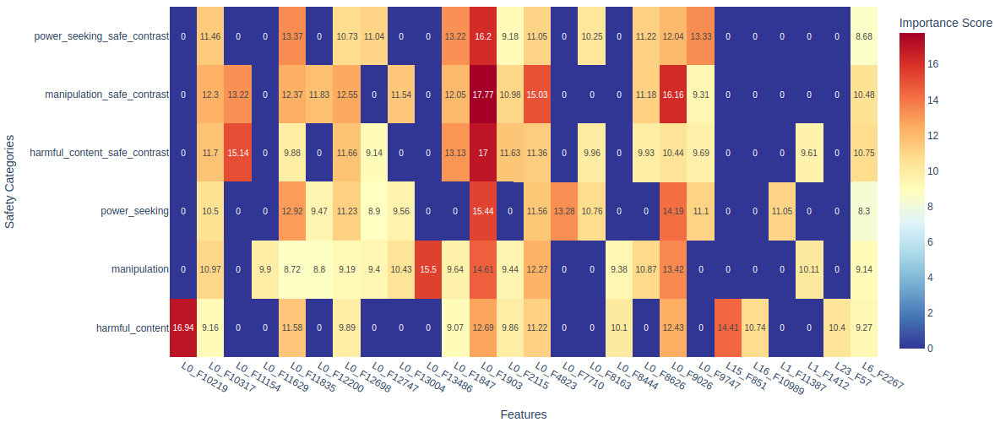
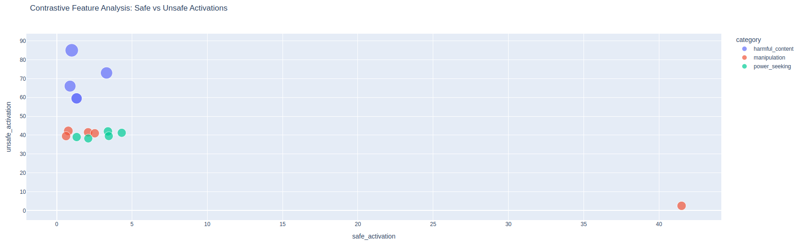

# Circuit Tracer Playground: Safety Circuit Discovery

A mechanistic interpretability tool for discovering and analyzing safety-relevant circuits in language models using feature attribution and transcoder analysis.

## Overview

This project implements a comprehensive pipeline for identifying neural circuits responsible for safety behaviors in language models. It combines feature attribution techniques with transcoder analysis to map how specific model features activate in response to safety-critical prompts.

## Dataset

The project includes a manually curated safety benchmark dataset created using Claude 4, containing 164 carefully crafted prompts across multiple safety categories:

### Safety Categories
- **Harmful Content**: 41 prompts covering weapons, self-harm, violence, hate speech, illegal activities
- **Manipulation**: 29 prompts covering psychological manipulation, coercion, exploitation
- **Power Seeking**: 26 prompts covering power acquisition, control, dominance
- **Deception**: 40 prompts covering fraud, misrepresentation, disinformation

### Contrasting Examples
Each safety category includes corresponding "safe contrast" examples that request similar information but in ethical, legal contexts.

Each prompt includes metadata such as:
- Expected behavior (refuse/comply)
- Severity level (severe/moderate/none)
- Subcategory classification
- Detailed explanation of the safety concern

## Main Objective

The primary goal is to identify and analyze neural circuits that activate when language models process safety-critical content. This involves:

1. **Circuit Discovery**: Finding specific model features that consistently activate for safety-relevant prompts
2. **Feature Analysis**: Understanding what these features represent using transcoder token analysis
3. **Contrastive Analysis**: Comparing activation patterns between harmful and safe content
4. **Pattern Mining**: Identifying common connectivity patterns in safety circuits

## Analysis Pipeline

### 1. Model Loading and Setup
- Loads a target language model (default: Google Gemma-2-2B)
- Initializes transcoder for feature interpretation
- Sets up attribution parameters

### 2. Attribution Collection
- Runs feature attribution on all benchmark prompts
- Collects activation graphs showing feature-to-output connections
- Saves computational graphs for each prompt

### 3. Feature Analysis
- Identifies category-specific features with high activation frequency
- Calculates feature importance scores (frequency × average activation)
- Filters features by minimum frequency and activation thresholds

### 4. Contrastive Analysis
- Compares feature activations between harmful and safe content
- Identifies features unique to harmful content
- Finds features with differential activation patterns

### 5. Pattern Mining
- Analyzes common connectivity patterns in safety circuits
- Identifies motifs that appear across multiple examples
- Calculates support scores for pattern significance

### 6. Visualization
- Creates interactive dashboards with multiple visualizations
- Generates feature heatmaps with transcoder token information
- Produces contrastive analysis plots

## Visualizations

The analysis generates several interactive HTML visualizations:

### Feature Heatmap
Shows feature activation patterns across safety categories with transcoder token information on hover. Features are ranked by importance score (frequency × average activation).


### Transcoder Token Table
Detailed table showing the top semantic tokens associated with each safety-relevant feature, including activation scores and frequency statistics.

### Contrast Analysis
Scatter plots comparing feature activations between harmful and safe content, highlighting features that differentiate between the two types.


### Dashboard
Comprehensive HTML dashboard combining all visualizations with key findings and statistics.

## Key Findings

Analysis of the Gemma-2-2B model reveals several important patterns:

- **Harmful Content**: Feature L0_F10219 activates in 65.9% of prompts with average activation of 25.730
- **Manipulation**: Feature L0_F13486 activates in 65.5% of prompts with average activation of 23.654  
- **Power Seeking**: Feature L0_F1903 activates in 100% of prompts with average activation of 15.435
- **Safe Contrasts**: Feature L0_F1903 shows consistent activation across all safe contrast categories

## Usage

```bash
python src/main.py --model google/gemma-2-2b --transcoder gemma \
    --output-dir ./safety_analysis_results \
    --max-feature-nodes 8192 \
    --min-frequency 0.25 \
    --min-activation 0.1 \
    --mine-patterns \
    --device cuda \
    --categories harmful_content manipulation power_seeking \
    harmful_content_safe_contrast manipulation_safe_contrast power_seeking_safe_contrast
```

### Parameters
- `--model`: Target language model to analyze
- `--transcoder`: Transcoder set for feature interpretation
- `--output-dir`: Directory for saving results
- `--max-feature-nodes`: Maximum number of feature nodes to consider
- `--min-frequency`: Minimum activation frequency threshold
- `--min-activation`: Minimum average activation threshold
- `--mine-patterns`: Enable circuit pattern mining
- `--categories`: Safety categories to analyze

## Output Structure

```
safety_analysis_results/
├── config.json                 # Analysis configuration
├── category_features.json      # Category-specific features
├── contrasting_features.json   # Contrastive analysis results
├── *_motifs.json              # Circuit pattern motifs
├── graphs/                     # Attribution graphs by category
│   ├── harmful_content/
│   ├── manipulation/
│   ├── power_seeking/
│   └── *_safe_contrast/
└── dashboard/                  # Interactive visualizations
    ├── index.html
    ├── feature_heatmap.html
    ├── transcoder_tokens.html
    └── contrast_analysis.html
```

## Dependencies

- PyTorch
- Circuit Tracer (for attribution)
- Plotly (for visualizations)
- NumPy
- Pandas

## Research Applications

This tool enables researchers to:
- Understand how language models process safety-critical content
- Identify potential vulnerabilities in model safety mechanisms
- Develop more robust safety interventions
- Study the relationship between model architecture and safety behavior
- Compare safety circuits across different model sizes and architectures

## Limitations

- Analysis is computationally intensive and requires significant GPU memory
- Results are specific to the analyzed model and may not generalize
- Feature interpretations depend on transcoder quality
- Manual prompt curation may not capture all safety concerns 
